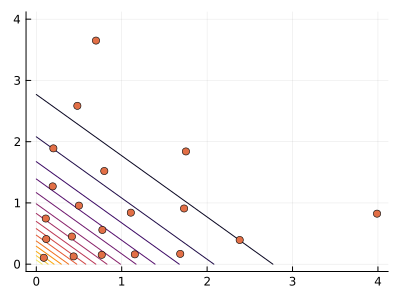

# Support Points

This is a Julia implementation of the _support points_ methodology introduced
by Mak and Joseph in 2018.  Support points are a finite collection of
points whose empirical distribution represents a given target distribution.

## Usage

We generate points in the plane whose coordinates are independent
and follow standard exponential distributions.  Then we plot the
support points along with the underlying density countours.

````julia
using SupportPoints, Plots, StableRNGs, LaTeXStrings, Statistics, Printf, Distributions
rng = StableRNG(123)

n = 1000
p = 2

d = Exponential(1)
Y = rand(rng, d, p, n)
X = supportpoints(Y, 20; maxit=1000)

function plot_density(dx, dy, xr, yr)
    x = range(first(xr), last(xr), 20)
    y = range(first(yr), last(yr), 20)
    f(x, y) = pdf(dx, x) * pdf(dy, y)
    X = repeat(reshape(x, 1, :), length(y), 1)
    Y = repeat(y, 1, length(x))
    Z = map(f, X, Y)
    plt = contour(x, y, Z, cbar=false, levels=15)
    return plt
end

plt = plot_density(d, d, (0, 4), (0, 4))
plt = plot!(plt, X[1, :], X[2, :], seriestype=:scatter, label=nothing)
Plots.savefig(plt, "./assets/readme1.svg")
````



As a second example we consider points whose coordinates
are independent and follow Beta(2, 4) distributions.

````julia
d = Beta(2, 4)
Y = rand(rng, d, p, n)
X = supportpoints(Y, 20; maxit=1000)

plt = plot_density(d, d, (0, 1), (0, 1))
plt = plot!(X[1, :], X[2, :], seriestype=:scatter, label=nothing)
Plots.savefig(plt, "./assets/readme2.svg")
````


## References

[1] Support Points. Simon Mak, V. Roshan Joseph. https://arxiv.org/pdf/1609.01811.pdf

---

*This page was generated using [Literate.jl](https://github.com/fredrikekre/Literate.jl).*

